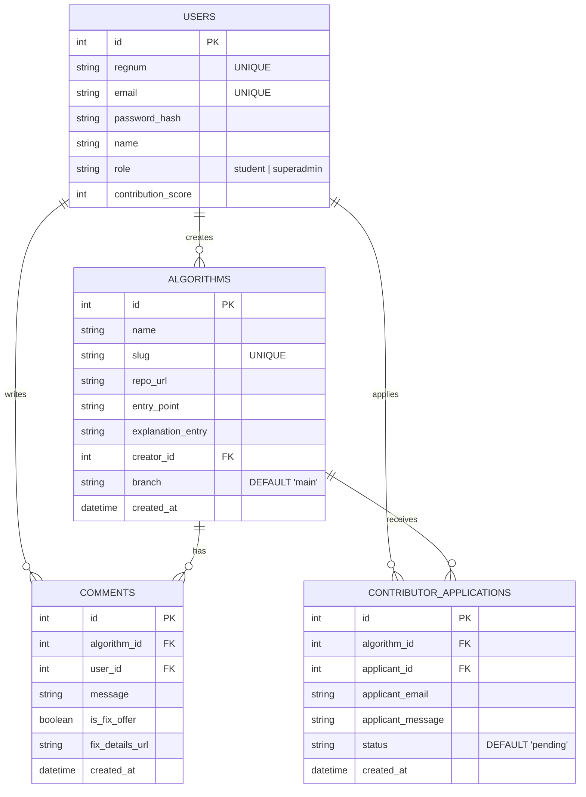
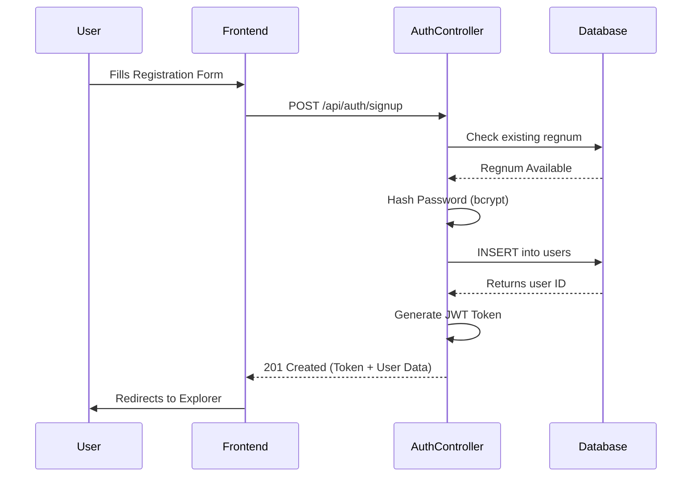
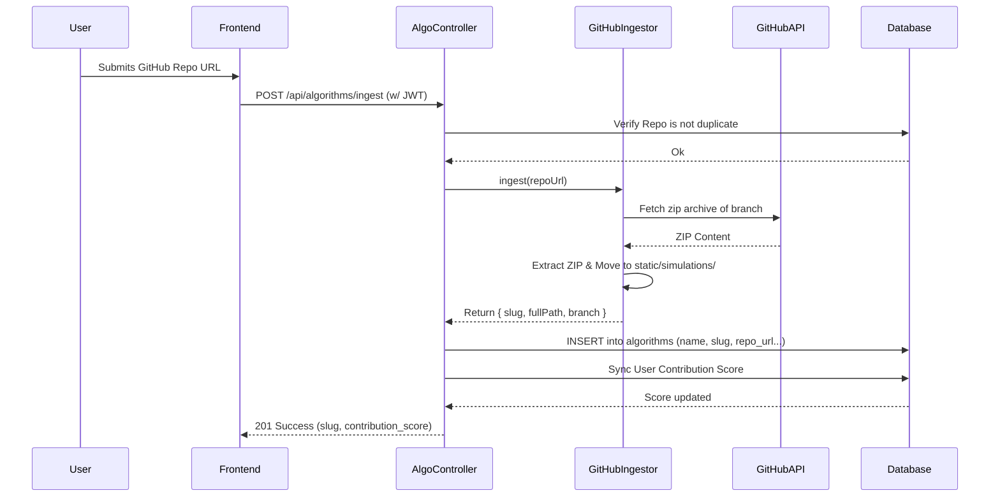
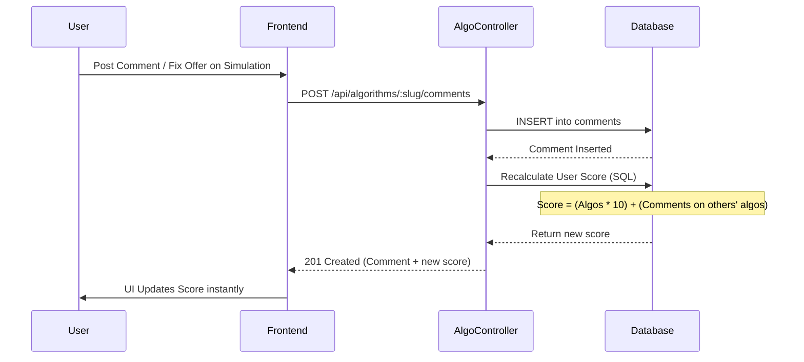

# Swarm Learning System (SLS)

## Overview
Swarm Learning System (SLS) is an interactive, gamified platform designed to teach Swarm Intelligence algorithms (like Ant Colony Optimization and Artificial Bee Colony) through interactive visualizations. Students can explore algorithms, ingest their own algorithm implementations from GitHub repositories, participate in discussions, offer fixes, and climb the leaderboard through a contribution-based scoring system.

## 🏗 System Architecture

The system is split into two primary components, utilizing a modern, serverless-ready stack:

### Frontend
- **Framework:** React 19 via Vite
- **Routing:** React Router v7
- **Styling:** Vanilla CSS (`App.css`, `index.css`) & Lucide React for iconography
- **State Management:** React Context API for global state (`AuthContext`)

### Backend
- **Framework:** Express.js 5.x
- **Database:** SQLite (local) / Turso (LibSQL for production edge computing)
- **Authentication:** JWT (JSON Web Tokens) with `bcryptjs`
- **Integrations:** Direct GitHub repository ingestion (`extract-zip`, Axios)

---

## 🗄️ Database Schema

The database is built locally on SQLite and scales to the edge using Turso.



---

## 🔄 Core System Workflows (Sequence Diagrams)

### 1. User Authentication Flow



### 2. GitHub Algorithm Ingestion Flow

The platform allows dynamic ingestion of simulations directly from GitHub, making it a highly extensible learning hub.



### 3. Gamification & Commenting Flow



---

## 🚀 Deployment & Infrastructure

The project is designed with a Serverless mindset, ready for deployment on Vercel.

- **Frontend:** Built and exported by Vite.
- **Backend:** Hosted as a Vercel Serverless Function via `vercel.json` rewrites mapping `/api/*` to `backend/src/server.js`.
- **Database:** Auto-detects environment. If `TURSO_DATABASE_URL` is present, it uses `@libsql/client` to connect to the Turso Edge Database; otherwise, it falls back to local `sqlite3`.
- **Static Assets:** GitHub ingests are temporarily stored in `/tmp/simulations` on Vercel (due to serverless file system read-only constraints) and served directly through Express `express.static()`.

## 🛠 Prerequisites for Local Development

- **Node.js** v18+
- **NPM** or **Yarn**

### Running Locally

**1. Clone the repository:**
```bash
git clone <repository-url>
cd swarm-learning-system---sls
```

**2. Backend Setup:**
```bash
cd backend
npm install
npm start
```
*The backend will run on `http://localhost:3001` and create a local SQLite database in `backend/data/database.db`.*

**3. Frontend Setup:**
```bash
cd frontend
npm install
npm run dev
```
*The frontend will start on `http://localhost:5173`.*

---
*Developed by the Swarm Learning Platform Team.*
