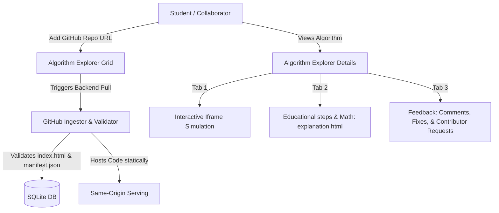
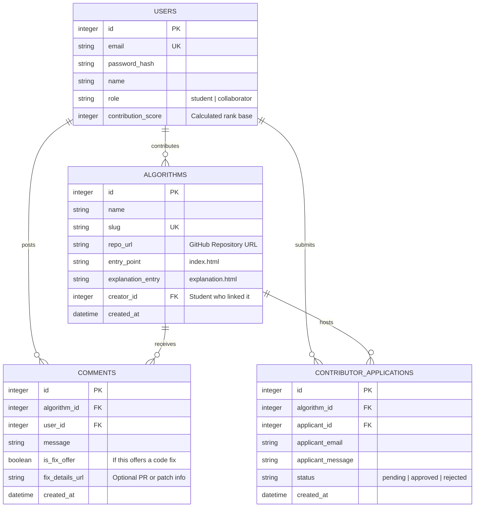

# Swarm Learning Platform - Collaborative GitHub-Linked Simulation Plan

This revised plan adapts the **Swarm Learning Platform** into a collaborative, community-driven ecosystem. Students discover algorithms, study their mechanics, run interactive simulations, and **contribute new ones by pasting GitHub repository URLs**. 

Additionally, students collaborate on existing algorithms by suggesting improvements, offering fixes, and applying to become developers.

---

## Core System Architecture & User Flow

---

## 1. Simplified Dynamic Algorithm Ingestion via GitHub

Instead of manual zip files, algorithm creation is fully driven by Git integration:
1.  **Add Repo Form**: A student pastes their public GitHub Repository URL (e.g., `https://github.com/abdelrahman/swarm-aco`).
2.  **Repository Ingestion**: 
    *   The backend validates the URL pattern.
    *   It downloads the repository's latest master/main branch zip bundle using a fast, non-blocking HTTP fetch:
        `https://github.com/{username}/{repo}/archive/refs/heads/main.zip` or `archive/refs/heads/master.zip`.
    *   It unzips this archive directly into `backend/static/simulations/{slug}/`.
3.  **Module Validation**:
    *   The system checks for:
        *   `index.html` (Interactive simulation entrypoint).
        *   `explanation.html` (Educational step-by-step/math explanation, loaded directly in Tab 2).
        *   `manifest.json` (Algorithm metadata).
4.  **Author Contribution**: The system records the uploading student as the **Original Author** of the algorithm. This dynamically increases their ranking on the **Contribution Leaderboard**!

---

## 2. Updated Algorithm Page Structure (Three Pages / Tabs)

When a student clicks on an Algorithm Card from the main page, they are presented with a premium workspace containing three dedicated tabs:

### Page 1: Interactive Simulation Page (`index.html`)
*   Loads the dynamic simulation (`index.html`, `style.css`, `script.js` and local assets) in an isolated `iframe`.
*   Uses **Same-Origin Direct DOM Access** from the React app:
    *   React can read real-time stats directly (e.g., `iframe.contentDocument.getElementById('current-best-nectar').innerText`) via a simple DOM polling interval.
    *   React can feed parameters to the simulation inputs directly (e.g., modifying `iframe.contentDocument.getElementById('bee-count').value` and calling `.dispatchEvent(new Event('change'))`).
    *   React injects an override stylesheet to hide the local simulation sidebar (`.sidebar { display: none !important; }`), allowing the canvas to expand seamlessly inside the React dashboard.

### Page 2: Educational Steps & Math Page (`explanation.html`)
*   Loads a clean text/HTML file (`explanation.html`) bundled directly with the GitHub repository.
*   Shows the step-by-step algorithms mechanics, biological inspiration, and mathematical models (using standard math notations).
*   By rendering the file directly inside a styled container (or clean iframe), collaborators can easily write rich educational content using basic HTML structures.

### Page 3: Collaboration & Feedback Page (Comments, Fixes & Contribs)
*   **Discussion Board**: Standard comments section for students to talk about adjustments, performance improvements, or educational clarity.
*   **Offer a Fix**: A specialized form where students can submit patches, fix descriptions, or GitHub pull request URLs to improve the simulation.
*   **Contributor Application**: A "Become a Contributor" button where students supply their contact **email** and a brief message. This notifies the original creator, encouraging peer-to-peer coding collaboration.
*   Every approved improvement or verified review increases the helper's contribution index!

---

## 3. Contribution-First Leaderboard System

The first, primary page of the leaderboard ranks students strictly on their **Contributions to the Swarm Learning Ecosystem**:

$$\text{Contribution Score} = (100 \times \text{Algorithms Contributed}) + (25 \times \text{Validated Improvements/Fixes}) + (10 \times \text{Helpful Feedback Suggestions})$$

*   **Leaderboard Grid**:
    *   Rank #1: Abdelrahman Mamdouh (3 Algorithms Contributed, 5 Fixes Offered) -> **Score: 425**
    *   Rank #2: ...

---

## 4. Simplified Database Schema (SQLite)

We model these exact collaborative relationships using SQLite (`backend/database.db`):

---

## 5. Front-End Interface Flow

*   **Explorer Route (`/explorer`)**:
    *   Visual Grid of all dynamic cards.
    *   Includes a special, premium card: `[ + Contribute New Algorithm ]`.
    *   Clicking the special card opens a glassmorphism modal requesting:
        *   Algorithm Name & Description.
        *   GitHub Repository URL (e.g. `https://github.com/user/aco-simulation`).
        *   Difficulty Level (Beginner/Intermediate/Advanced).
3.  **Details Workspace (`/algorithm/:slug`)**:
    *   Header highlighting original student author and GitHub repository source.
    *   Beautiful tab bar with 3 states:
        *   `[ 🎮 Live Simulation ]` -> Hosts interactive Same-Origin iframe.
        *   `[ 📖 Biological & Math Explanation ]` -> Embeds `explanation.html` description.
        *   `[ 💬 Comments & Contributions ]` -> Thread of comments, "Offer a Fix" logs, and a Contributor Contact form.

---

## Verification Plan

### Manual Verification Flow
1.  **Clone Ingestion Simulation**: Trigger backend pull with a mock repository, confirming that the files extract successfully to `backend/static/simulations/` and populate SQL models.
2.  **Direct DOM Integration Check**: Toggle sliders on our React page to verify values change inside the simulation iframe instantly, and observe output metrics syncing in real-time.
3.  **Tab Verification**: Verify switching between the Simulation, Educational text (`explanation.html`), and Comment cards renders correctly with isolated states.
4.  **Feedback & Application Flow**: Fill out a contributor request, verify it saves correctly to SQLite, and check that the contributor score increments the student's global contribution rank.
